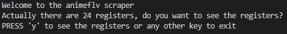

# Ruby Scraper Capstone

 In this project, I create a scraper script that obtains a list of anime from `https://www3.animeflv.net/browse` and shows the data in the terminal. It ask if you want more information about one of the anime listed and shows that information if you want.
 I choose that page because it could be useful for me and some of my friends.

## Built With

- Ruby

Gems:

- HTTParty
- Nokogiri

### Prerequisites

- Ruby Installed

### Setup

- Open your terminal and go to the directory where you want to clone the repo.

- Clone the repository to your local machine. Type `$ git clone https://github.com/julian3493/Ruby_Scraper_Capstone.git`

- Go to the Ruby_Scraper_Capstone directory. Type `$ cd Ruby_Scraper_Capstone`

- Install bundler. Type `$ gem install bundler`

- Install the neccesary gems to run the scraper. Type `$ bundle install`

- Now your enviroment is ready to run the scraper. Type `$ ruby bin/main.rb`

### Using the scraper

- When you run the scraper. You will see a welcome message and it will ask you if you want to see the registers found.

- You need to write 'y' and press enter if you want to see the registers. When you do that you will see a list of anime that includes Title, Type, and, URL for each Anime.

- At the end of the list you will see a message asking if you want more information about one anime. If you want to see more information you need need to write 'y' and press enter. You can also press any other key if you want to finish the script.

- If you choose see more information about, you need to write the title of the anime which you want more information. You must write the title exactly how it apears in the list.

- When you write the name, you will see the Anime Title, Description, and Status. After that you will see a goodbye message and the script finish.

### Run tests

- Just type the command `rspec` in your terminal to check the results of the tests.

## Author

👤 **Julian Ramos**

- GitHub: [@julian3493](https://github.com/julian3493)
- Twitter: [@JulianR16893833](https://twitter.com/JulianR16893833)
- LinkedIn: [Julián Ricardo Ramos Arevalo](https://www.linkedin.com/in/juli%C3%A1n-ricardo-ramos-arevalo-3868ba135/)

## 🤝 Contributing

Contributions, issues, and feature requests are welcome!

Feel free to check the [issues page](https://github.com/julian3493/Ruby_Scraper_Capstone/issues).

## Show your support

Give a ⭐️ if you like this project!

## Acknowledgments

- The Odin Project